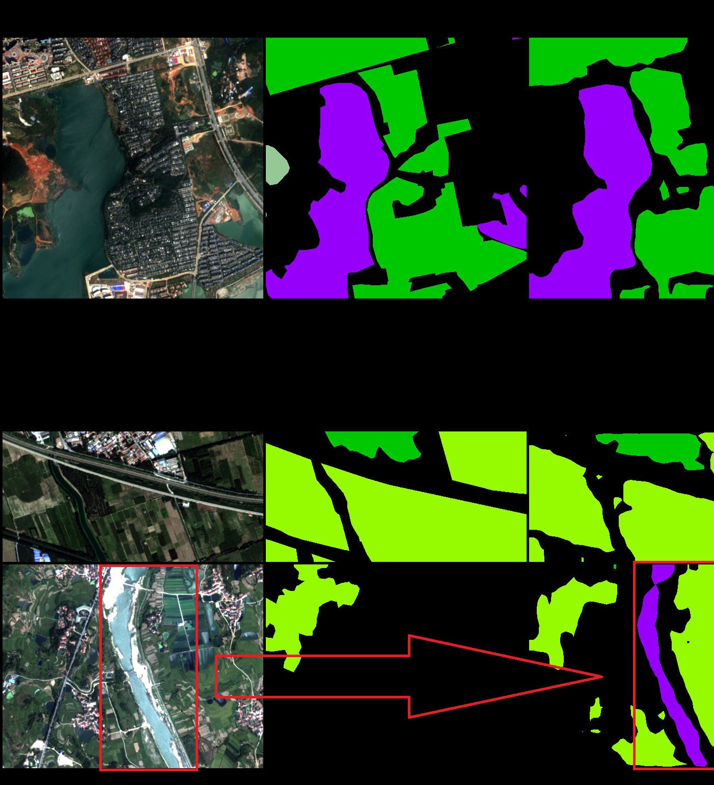
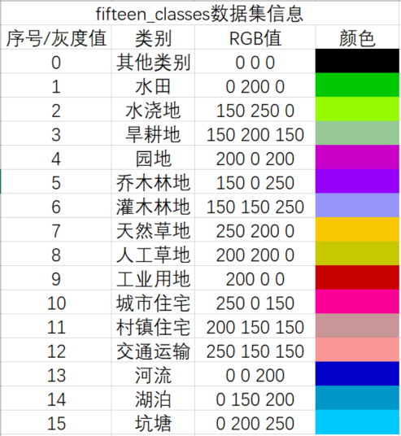
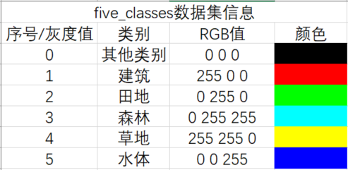
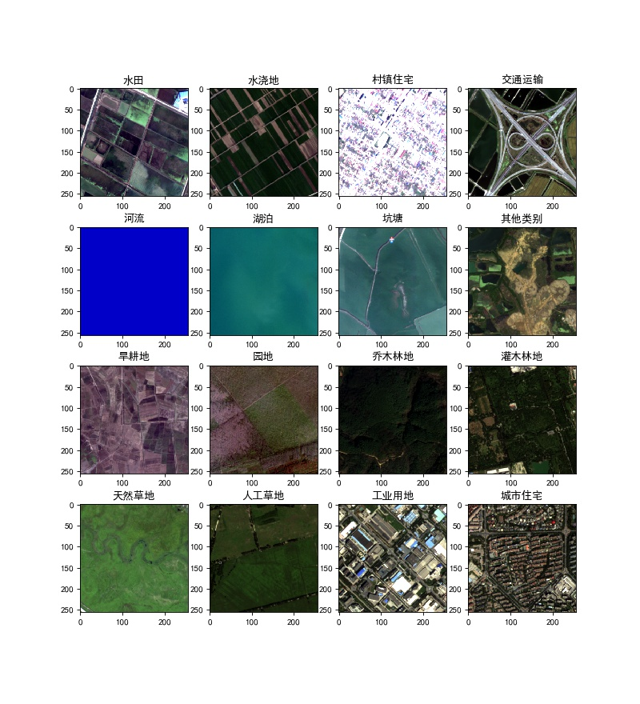

# RSSS-PyTorch
## High-Resolution-Remote-Sensing-Semantic-Segmentation-PyTorch

## Use TensorBoard to view various indicators and visualization （img, GT, Pre）
   - local ：
    tensorboard --logdir=<your_log_dir
   - Examples of various indicators 
   
   
   
   - Visual test set sample （img, GT, Pre）
   
   

    
   
## Data

- **Scene Classification **
    ##### 2019 Remote Sensing Image Sparse Representation Intelligent Analysis Competition 
    Link: https://pan.baidu.com/s/1NFvL8KV4pRwumBah05GG8A  x5k0
    
- **Change Detection **
    ##### 2019 Remote Sensing Image Sparse Representation Intelligent Analysis Competition 
    Link: https://pan.baidu.com/s/1u4WKF_rRysvc0tEnrYq0Sg  4udm

- **Semantic Segmentation **
    ##### [2019 County Agricultural Brain AI Challenge ](https://tianchi.aliyun.com/competition/entrance/231717/information)
    Link: https://pan.baidu.com/s/1VXMLTCZM10quebX6Wf169w  cmt7
    ##### 2019 Remote Sensing Image Sparse Representation Intelligent Analysis Competition 
    Link: https://pan.baidu.com/s/1LiMjwotcnQus0HFntEiZog  3obz
    ##### [GID](https://arxiv.org/abs/1807.05713)
    [Official download link ](https://x-ytong.github.io/project/GID.html)
    
    Link: https://pan.baidu.com/s/1LM6WX6zgihzIlY5OJWGEFA  n8n0
    
    - Data set information 
    
        
        
        
    
    - Sample display 
        

## Reference

    https://github.com/kazuto1011/deeplab-pytorch
    https://github.com/fregu856/deeplabv3
    https://github.com/zijundeng/pytorch-semantic-segmentation
    https://github.com/jwyang/dcn.pytorch
    https://github.com/lin-honghui/tianchi_CountyAgriculturalBrain_top1?spm=5176.12282029.0.0.278c1bb8nTiHfq

